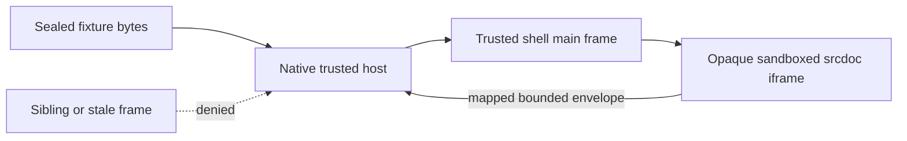

# Real WKWebView Trust Boundary Checkpoint

## Summary

Add the issue-owned Apple WebKit boundary test around the packaged trusted shell and its existing verified fixture. Drive a real WKWebView, wait for the mapped authored frame, and inspect the actual materialized srcdoc rather than a string-only approximation. Prove that verified bytes remain unchanged while default-deny CSP, exact artifact base, and compatibility prelude are inserted before authored scripts; that no URL becomes iframe navigation authority; that only the mapped source reaches native routing while a sibling and caller-supplied session cannot mint authority; that ambient native, Nostr, storage, and direct-network capabilities remain absent or denied; and that idempotent teardown rejects late bridge work. Keep NMP canonical ownership and the existing trusted-shell bootstrap unchanged.

## Boundaries

## Detailed Plan

## Checkpoint scope

Create `TrustedNappletWebKitBoundaryTests.swift` under the Apple package test target. Reuse `TrustedShellResources.fixtureURL`, `NappletArtifact.bundledCompatibilityFixture()`, and `TrustedNappletView`; do not introduce another shell, bridge, or runtime bootstrap.

## Executable assertions

1. Mount the packaged fixture in a real `WKWebView` and observe its legitimate mapped request.
2. Read the outer frame's actual `srcdoc` and assert there is no `src` navigation authority, the sandbox is `allow-scripts`, CSP is the first head child, the exact per-session artifact base is second, the compatibility prelude is third, and every authored classic/module script follows it.
3. Compare the reader's sealed `/index.html` bytes with the packaged fixture to prove injection did not mutate signed bytes.
4. Evaluate bounded probes inside the mapped frame for `window.nostr`, native handlers, host DOM, WebKit storage, workers, fetch/WebSocket, and subresource transport; retain negative transport evidence.
5. Send a legitimate mapped envelope containing a forged session field and an equivalent sibling-frame envelope. Assert only the mapped source reaches the native request boundary.
6. Stop twice, then attempt late bridge activity and content-process termination. Assert no new request or lifecycle activity escapes.

## Validation

Run the focused Apple package test containing the new owner and the trusted-shell Node contract if the local artifact is available. Do not run broad workspace gates for this land-first checkpoint.

## Rollback

The checkpoint is test-only unless a real-WebKit failure exposes a narrowly scoped host defect. Reverting the test commit restores the prior surface without migration or persistence consequences.

## Follow-up

After landing, start from fresh main for malformed-DOM before/inside/after-head coverage, module ordering, replacement generations, crash-backed runtime ownership, unknown-message no-op state proof, and ciphertext zero-write evidence.

## Rule And ADR Check

- Uses the existing trusted shell and fixture rather than creating a parallel bootstrap.
- Keeps verified authored bytes immutable and runtime material outside the signed aggregate.
- Preserves one-way platform to runtime to NMP facade dependency and does not mutate the NMP checkout.
- Adds executable Apple behavior evidence in the issue-designated owner file.

## Possible Rule Or ADR Loosening

- No repository rule or ADR needs loosening.

## Possible Rule Tightening

- A later checkpoint may promote the Apple package into the Quick and Nimble BDD table once the first real-WebKit journey has proven stable.

## Alternatives Considered

- Extend scattered inline-canary tests only; rejected because issue 159 names a single executable owner and existing tests are evidence inputs.
- Add a second WebKit shell harness; rejected because it would duplicate the production bootstrap and weaken the proof.
- Use Node-only trusted-shell tests; rejected because they cannot prove WebKit content worlds, sandbox behavior, or native teardown.

## Certainty

88 percent.

## Decision

ready

## Hosted Artifacts

- Plan page: https://pablof7z.github.io/nampplets/plans/issue-159-wkwebview-trust-boundary/

- TTS audio: https://blossom.primal.net/d1d0ce4e08b264ff40e159f8fbfb6de1ff427fbb49032ca30c74fbd06ab5851e.mp3
