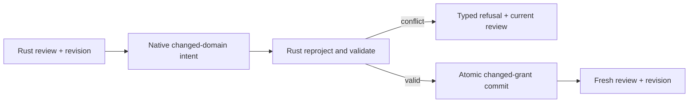

# Rust-owned permission review revisions and changed-domain intent

## Summary

Make mixed managed and user-decidable permission review a real Rust-owned, revision-checked transaction instead of a Swift-filtered full replacement.

## Boundaries

## Detailed Plan

## Contract

Add an opaque permission-review revision owned by runtime-app. Project, for every requested capability, the effective decision, controller source, whether it is user-changeable, and Rust-offered choices. A submission names the exact-build principal, the base revision, and a finite set of changed-domain decisions.

## Atomic validation and apply

Under the RuntimeApp state boundary, rebuild the current review and compare its revision with the submitted base revision. Refuse stale review, exact-build mismatch, managed-policy/controller change, duplicate or unknown domains, no-longer-valid choices, dependency failure, and persistence failure before publishing an applied event. Apply only explicit changed domains through the existing atomic grant/store commit. Return the refreshed review after success. Empty changed intent is a native no-op; all-managed review never fabricates a batch.

## FFI and Apple

Project revision/controller metadata and a typed permission change result through runtime-ffi. Regenerate the checked-in Swift facade binding. Adapt RuntimeWorkbenchPermissionManager to submit the current review revision and pass only explicit changed choices. After a successful apply, replace its snapshot with Rust's refreshed review and return to a reviewable state for persistent consumers; the first-run sheet still dismisses once and launch remains separate.

## Verification

Add runtime-app unit tests and executable Cucumber scenarios for mixed managed plus user-decidable success, all-managed read-only behavior, repeated changed-domain apply, stale review, managed-policy change, exact-build isolation, duplicate/unknown keys, and atomic refusal. Add real RuntimeController FFI tests for mixed success and conflict/refusal projection. Add focused Swift tests for exhaustive controller/refusal projection and repeated manager use without a recording-only false positive.

## Migration and rollback

This is an internal pre-release FFI contract. Regenerate bindings in the same change; no persisted schema migration is expected. Rollback is the single PR because grant rows retain their existing representation.

## Observability

Typed refusal codes and the returned current review make conflicts visible without polling or native policy inference.

## Open questions

Choose the smallest deterministic revision representation that changes whenever the exact-build permission review's decision/controller validity changes, while remaining bounded and non-secret.

## Rule And ADR Check

- Rust continues to own product policy, validation, lifecycle, persistence, limits, and error semantics.
- The exact-build principal remains manifest author, dTag, and aggregate hash.
- Runtime persistence remains limited to runtime grants and does not create Nostr truth.
- The runtime-app Cucumber pilot receives executable Given/When/Then coverage before the behavior is claimed.
- Native performs mechanical projection and bounded intent submission only.

## Possible Rule Or ADR Loosening

- No repository rule or ADR needs loosening.

## Possible Rule Tightening

- Consider later requiring every mutable native review contract to carry an opaque Rust revision and return the current snapshot on conflict.

## Alternatives Considered

- Keep Swift filtering and teach Rust to accept any subset: rejected because it cannot distinguish stale policy from deliberate omission.
- Have native submit managed outcomes: rejected because native would fabricate host policy and violate ownership.
- Continue full replacements with a revision: safer than current main but still lets a persistent review reassert unrelated stale values.
- Automatically refresh and retry conflicts in native: rejected because it could silently change the meaning of the person's action.

## Certainty

93 percent.

## Decision

ready

## Hosted Artifacts

- Plan page: https://pablof7z.github.io/nampplets/plans/issue-201-permission-review-revisions/

- TTS audio: https://blossom.primal.net/8781662667890ef882cbe53e035f669d70057eb36637415789c3646c4a019922.mp3
